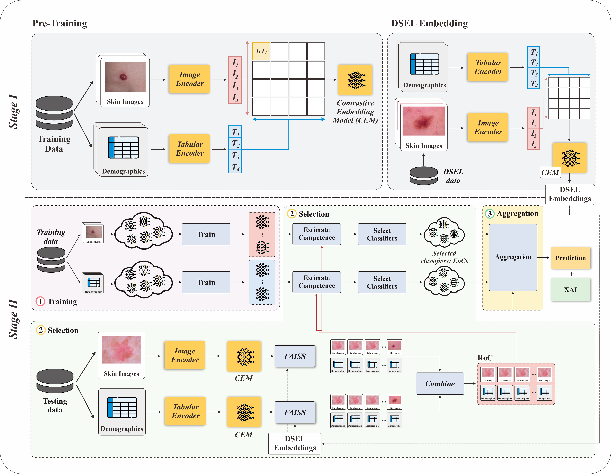

# MM-DES: Multimodal Dynamic Ensemble Selection for Clinical Prediction

**MM-DES: Enhancing multimodal clinical prediction using joint contrastive embeddings and dynamic ensemble selection.**

---

## 📌 Overview

MM-DES is a novel framework designed for **multimodal clinical prediction**, combining:

- 🧾 Clinical text (EHR / notes)  
- 📊 Tabular data  
- 🖼️ Medical images  

The framework leverages:
- Joint contrastive representation learning  
- Dynamic Ensemble Selection (DES)  
- Region of Competence (RoC) modeling  

to improve predictive performance and robustness in healthcare applications.

---

## 🚀 Key Features

- ✅ Multimodal fusion (Image + Text + Tabular)  
- ✅ Contrastive learning for shared embeddings  
- ✅ Dynamic ensemble selection based on local competence  
- ✅ Improved performance on noisy and heterogeneous datasets  
- ✅ Built-in explainability (XAI support)  

---

## 🏗️ Framework Architecture



---

## 🔍 Explainability (XAI)

MM-DES includes interpretability mechanisms to understand:
- Which modality contributes most  
- Which classifiers are selected dynamically  
- Decision reasoning in the ensemble  


---

## ⚙️ Installation

Clone the repository:

```bash
git clone https://github.com/your-repo/mm-des.git
cd mm-des
```


